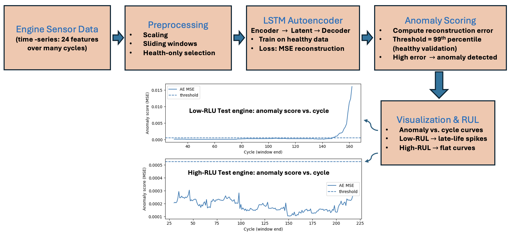

# Unsupervised Anomaly Detection using LSTM Autoencoder

This project demonstrates **unsupervised anomaly detection** on the **NASA Turbofan Engine Degradation (C-MAPSS)** dataset.
An **LSTM Autoencoder** is trained on healthy engine sensor readings to reconstruct normal behavior.
When degradation occurs, the reconstruction error (MSE) increases, allowing detection of abnormal operating conditions and remaining useful life (RUL) trends.



---

## Project Structure

```
anomaly-detection-structural-health-monitoring/
│
├── anomaly-detection_main.ipynb   # Main notebook for preprocessing, training, and visualization  
├── dataloader.py                  # Dataset loader 
├── model_LSTMAE.py                # LSTM Autoencoder model definition  
├── evaluate.py                    # Anomaly Scoring utilities  
└── README.md                      # Project documentation
```

---

## Project Overview

The goal of this project is to detect abnormal patterns in **multivariate time-series sensor data** from aircraft engines without using failure labels.

* **Training:** The autoencoder learns to reconstruct only *healthy* signals from early life cycles.
* **Testing:** During later cycles, when degradation appears, reconstruction error rises, indicating potential faults.
* **Evaluation:** Engines with **low RUL** show clear late-life error spikes, while **high RUL** engines remain stable.

---

## Dataset

**Dataset:** [NASA CMAPSS Turbofan Engine Degradation Simulation Data](https://data.nasa.gov/dataset/CMAPSS-Turbofan-Engine-Degradation-Simulation-Data/ff5v-kuh6)
or, (https://www.kaggle.com/datasets/behrad3d/nasa-cmaps/data)

Each subset (FD001–FD004) contains:

* Multiple engine runs until failure
* 3 operating settings
* 21 sensor measurements per cycle
* Corresponding RUL file for test sequences

For this project, the subset **FD001** was used.


## Model Architecture

**LSTM Autoencoder**

* Encoder: LSTM layers compress input time sequences
* Latent space: captures normal temporal patterns
* Decoder: reconstructs input sequence
* Loss: Mean Squared Error (MSE) between input and reconstructed sequence

Training is performed only on **healthy windows** (first 30% of each engine’s life).

---

## Results

| Engine Type                       | RUL Level    | Behavior                                      |
| --------------------------------- | ------------ | --------------------------------------------- |
| **Train engine (run-to-failure)** | Full life    | Sharp rise in anomaly score near final cycles |
| **Low-RUL test engine**           | Near failure | Late-life error spike indicating degradation  |
| **High-RUL test engine**          | Healthy      | Stable low anomaly score throughout           |


---
## Observations

* The model effectively learns normal operating dynamics.
* Degradation phases show increasing reconstruction error, marking the onset of faults.
* The unsupervised setup does not require labeled failures — useful for predictive maintenance.

---

## Installation & Run

### Install dependencies

```bash
pip install pandas numpy torch matplotlib scikit-learn
```

### Run the notebook

Open **`anomaly-detection_main.ipynb`** in Google Colab or Jupyter and run all cells sequentially.


